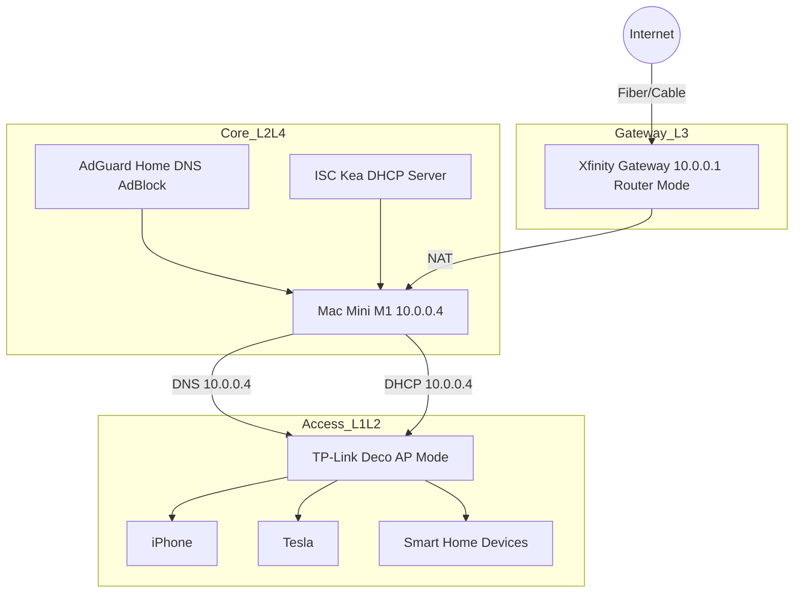

# home-dns-dhcp

```mermaid
flowchart TD

    Internet((Internet)) -->|Fiber/Cable| Xfinity

    subgraph Gateway_L3
        Xfinity[Xfinity Gateway 10.0.0.1 Router Mode]
    end

    subgraph Core_L2L4
        MacMini[Mac Mini M1 10.0.0.4]
        AdGuard[AdGuard Home DNS AdBlock]
        Kea[ISC Kea DHCP Server]

        AdGuard --> MacMini
        Kea --> MacMini
    end

    subgraph Access_L1L2
        Deco[TP-Link Deco AP Mode]
        iPhone[iPhone]
        Tesla[Tesla]
        IoT[Smart Home Devices]
    end

    Xfinity -->|NAT| MacMini
    MacMini -->|DNS 10.0.0.4| Deco
    MacMini -->|DHCP 10.0.0.4| Deco

    Deco --> iPhone
    Deco --> Tesla
    Deco --> IoT
```
